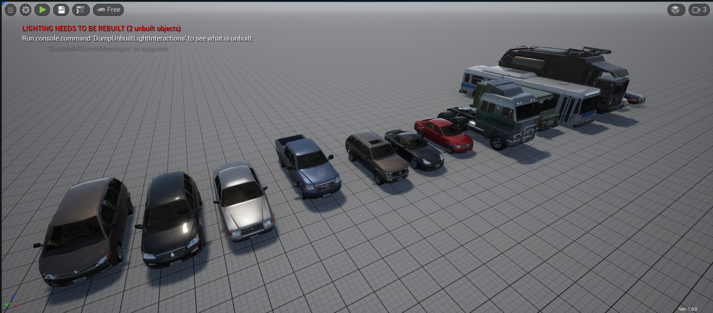

# SodaCitySampleVehicles

The SodaCitySampleVehicles is a plugin for UnrealEngine and SodaSim.
The SodaCitySampleVehicles provide an additional GhostVehicles library based on [City Sample Vehicles](https://www.unrealengine.com/marketplace/en-US/product/city-sample-vehicles)

## Install
1. Install [City Sample Vehicles](https://www.unrealengine.com/marketplace/en-US/product/city-sample-vehicles) to you __.uproject__
2. Copy SodaCitySampleVehicles plugin to [PATH_TO_UPROJECT]/Plugins folder